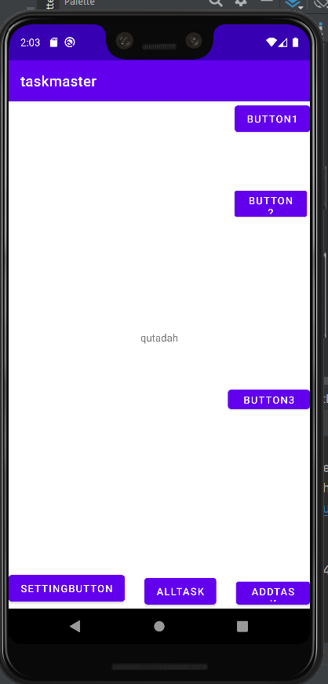

# taskmaster
day one :
create 3 page :
 * home that's contain label for the Home and buttons to take you to another pages
 * add task page that have two label and two text box to add an task
 * all task page that show the all task that you have

## Home Page

## Add Task Page

## All Tasks Page

day two :
* edit the home page and add more button to it 3 button to take you to page thats contain lorem text and label
* setting page that have a lebel and text box to add a user name for all pages
## home page

## button page

## setting page

